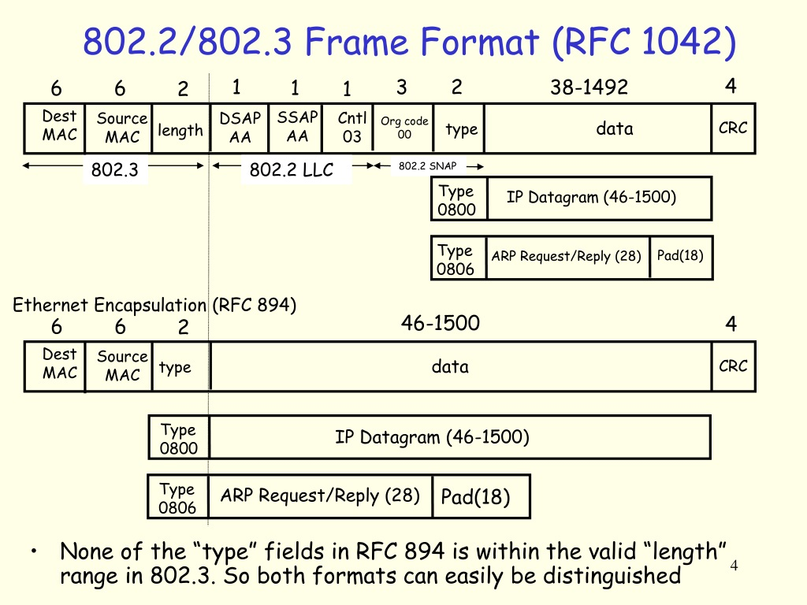
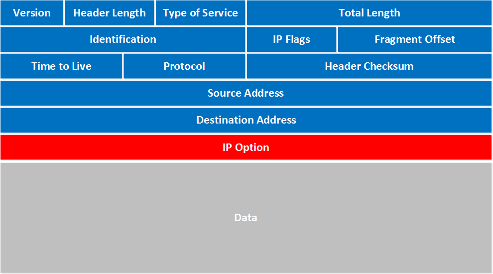

# PCAP command line tool and library 

a command line tool and library that can be used to extract and analyze `.pcap` file similar to wireshark and tcpdump

# Utility

1. read in pcap file and provide generic way to get all packet data 
2. provide reasonable layout to view and inspect packet data similar to [wireshark](https://www.wireshark.org/) and [tcpdump](https://www.tcpdump.org/)


# How to run

1. install a D lang compiler from the following [link](https://dlang.org/download.html)

2. clone the repository 

```sh
git clone https://github.com/kam-stand/PCAP.git

```
3. `cd` into project directory
```sh
cd PCAP_DUMP
```

4. run the bash script with `path/to/pcap/file`

> ☝️ optional : you can make the bash script an executable by running the command chmod `./run.sh`

```sh
./run.sh <path/to/pcap/file>

```

# Information

- When reading on ethernet frames and different link types. its important to note we are mostly reading data that is being transmitted from physical wires or wireless communication. In a `.pcap` file we are capturing from the end of  this transmission into a computer. Hence, the preamble and  sfd are not present :alien:

🧩 The Key Distinction: File Format vs Protocol Format

There are two layers here:
1. PCAP file format = endianness depends on the magic number

    The PCAP file format starts with a magic number in the first 4 bytes.

    That number tells you how the rest of the file should be interpreted (endianness-wise).

    So for things like packet headers, timestamps, and lengths — yes, you must honor this endianness.

2. Network protocols (Ethernet, IP, TCP, etc.) = always big-endian

    Once you're inside the packet data (like the Ethernet frame), the protocol itself dictates network byte order.

    And network byte order = big-endian, always — regardless of what the pcap file's endianness is.

# Resources

[PCAP file format specfification](https://www.ietf.org/archive/id/draft-gharris-opsawg-pcap-01.html)

[ETHERNET FRAME](https://en.wikipedia.org/wiki/Ethernet_frame)

[Additional info on PCAP](https://www.netresec.com/?page=Blog&month=2022-10&post=What-is-a-PCAP-file)

[Ethernet Frame types](https://www.slideserve.com/kmildred/ieee-802-lans-powerpoint-ppt-presentation)

[Ethernet Types](https://wiki.wireshark.org/Ethernet#EtherType)

[IP DATAGRAM](http://www.tcpipguide.com/free/t_IPDatagramGeneralFormat.htm)

# Diagrams

certain network protocols come with different formats. The following diagrams provide a visual to certain formats


❗ The format for a IEEE 802.3 Link type can be summarized in both as a data link and logical link header. The following [link](https://www.firewall.cx/networking/ethernet/ieee-8023-frame.html) showcases this. Furthermore, the diagram 
below shows the different way to interpret the actual payload




format of an IP packet




